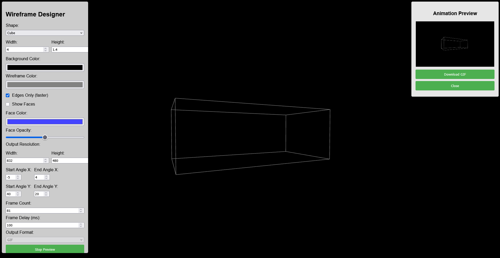

# Wireframe Animation Designer

Browser-based tools for creating 3D wireframe animations — no install required.



## The Tools

| File | What it does |
|------|--------------|
| `index.html` | **Wireframe Designer (v2)** — rotating wireframe animations of basic 3D shapes (cube, sphere, cylinder, cone, torus) with customizable colors, dimensions, and trajectory, exported as animated GIF. |
| `blockscene.html` | **Block Scene Motion Builder** — build 3D block scenes with camera motion for LTX 2.3 IC-LoRA conditioning videos. Load a reference photo and let AI (DepthAnythingV2, running fully in-browser) auto-generate blocks from its depth map, or place blocks by hand. Animate objects and camera drives, export H.264 MP4, and save/load scenes as JSON. |
| `wireframedesigner.html` | The original v1.0 single-file designer, kept for reference. |

## Running in the Browser (GitHub Pages)

Everything is static, so the tools can be hosted on GitHub Pages and used directly in the browser:

1. Repo **Settings → Pages → Source: Deploy from a branch → Branch: `main` / (root)** → Save.
2. After a minute the tools are live at:
   * `https://burgstall-labs.github.io/WireframeDesigner/` (Wireframe Designer)
   * `https://burgstall-labs.github.io/WireframeDesigner/blockscene.html` (Block Scene Motion Builder)

## Running Locally

All dependencies (`gif.js`, `gif.worker.js`) are included in the repo; three.js and the AI model load from CDNs. Because browsers restrict web workers on `file:///` URLs, run a local server:

```bash
git clone https://github.com/Burgstall-labs/WireframeDesigner.git
cd WireframeDesigner
python -m http.server
```

Then open [http://localhost:8000/](http://localhost:8000/) (Wireframe Designer) or [http://localhost:8000/blockscene.html](http://localhost:8000/blockscene.html).

## Desktop App

The Wireframe Designer can also be packaged as a cross-platform Electron desktop app — see [README-DESKTOP.md](README-DESKTOP.md).

## Usage: Wireframe Designer

1. Pick a shape and adjust its dimensions, colors, and face/edge display in the left panel.
2. Set the animation trajectory: start/end position offsets and X/Y rotation angles, frame count, and frame delay.
3. Click **Preview Animation** for a live preview; click again to stop.
4. Click **Create GIF Animation** to render. Progress is shown while frames are captured and encoded.
5. Preview the result and click **Download GIF**.

## Usage: Block Scene Motion Builder

1. (Optional) Load a reference image and align the view over it.
2. Add blocks manually (cube, floor, wall, pillar, ramp) — or click **Auto-detect** to run in-browser depth estimation on the reference image and generate blocks automatically (~50 MB one-time model download, cached afterwards).
3. Select blocks to edit their shape, size, position, and per-object motion.
4. Choose a camera motion preset with intensity and easing.
5. Play to preview, then export as H.264 MP4, or save the scene as JSON to continue later.

## Versions

* **v2.0** — modular Wireframe Designer (`index.html`), Block Scene Motion Builder, vendored gif.js, Electron packaging.
* **v1.0** — original single-file GIF tool (`wireframedesigner.html`).

## License

This project is licensed under the MIT License — see the [LICENSE](LICENSE) file for details.
